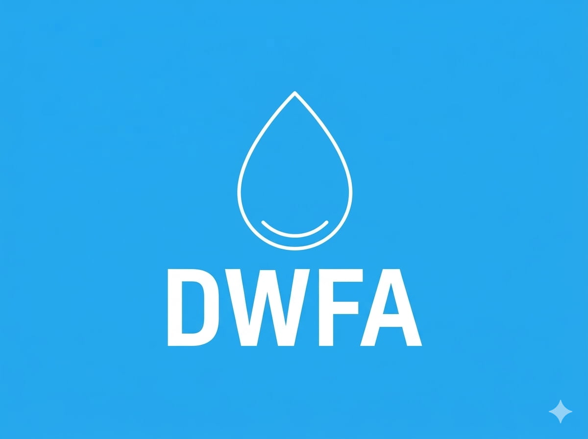
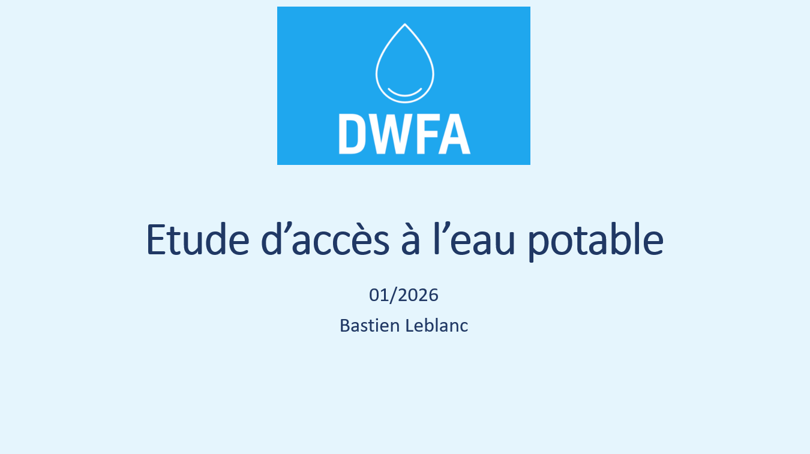
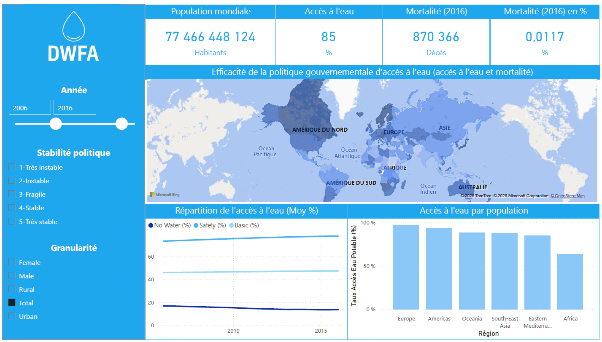

# DWFA
## Projet 10 - OpenClassRooms - Data Analyst

### Contexte :  
L’association DWFA à pour ambition de donner accès à l’eau au plus grand nombre.
Un bailleur de fonds à été sollicité avec pour objectif d’investir dans l’un des 3 domaines d’expertise de la DWFA :
* Création de services d’accès à l’eau potable
* Modernisation des services déjà existants
* Consulting auprès des administrations 

### Objectif :  
Constuire un dashboard permettant d'effectuer une première analyse de ces indicateurs.

### Livrables :  
* Dashboard Power BI répondant au cahier des charges : 

	* Mesure de ces indicateurs dans le temps : 
	
		- Taux de mortalité dû à de l’eau insalubre
		- Population / Densité de la population
		- Part d’habitants ayant accès à l’eau potable
		- Stabilité politique

	* Mesure de ces indicateurs à l'échelle nationale : 

		- Création de services
		- Modernisation des services
		- Consulting

	* Exigeances techniques : 
	
		- 3 vues : Mondial / Continental / National
		- 4 graphiques différents
		- Représentation temporelle et géographique
		- Filtres permettant d’isoler les pays instables
		- Nuage de point si 2 variables
		- 1 agrégation
		- Palette de couleur : bleu
		- Jointures
		- Modèle optimisé
		- Accessibilité

* Rapport PowerPoint présentant la construction du dashboard 

## Livrables :   

    
<strong>Présentation : </stong>

    
    
<strong>Dashboard Power BI : </stong>

    

